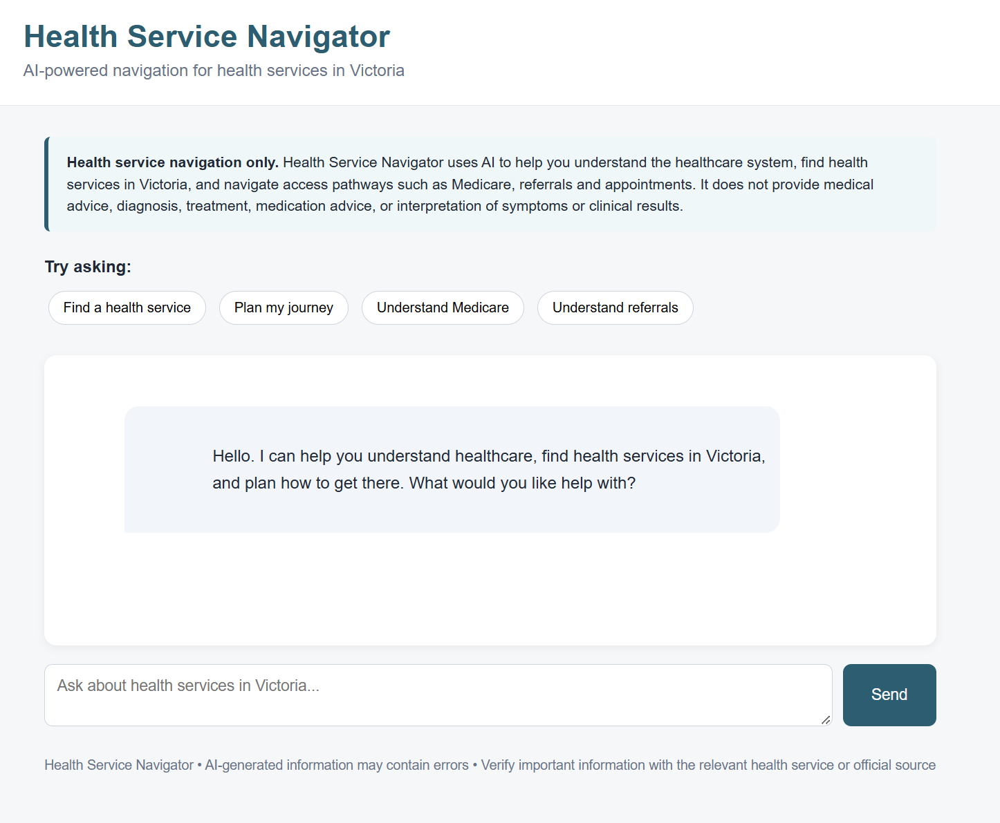

# Find Healthcare

Find Healthcare is an AI-assisted healthcare navigation application for understanding and accessing Australian healthcare services. It aims to reduce the knowledge and digital effort involved in navigating the existing healthcare ecosystem. It is deliberately not a diagnostic or clinical-advice chatbot.

| | |
| --- | --- |
| **Live** | [findhealthcare.au](https://findhealthcare.au) |
| **Purpose** | A simpler conversational navigation layer for Australian healthcare services |
| **Built with** | React · Vite · FastAPI · OpenAI · Google Maps Platform · Docker · Azure |
| **Status** | Public prototype |

## The problem

The problem is not simply a lack of healthcare information or digital resources. Useful service directories, websites, maps, transport tools and so on already exist. Availability, however, does not necessarily make those resources accessible or easy to use.

Many existing services still require a person to know what to search for, which service they need, what unfamiliar healthcare terms mean, where reliable information is located, how to interpret it and what to do next. That burden can be particularly high for someone unfamiliar with the Australian healthcare system.

Find Healthcare is intended to help bridge the gap between the resources that already exist and the people trying to use them. It does not replace healthcare providers, official information or service directories; it provides a conversational navigation layer over that ecosystem.

## Who and what barriers we are designing for

The project is designed around barriers rather than labels. These can include:

- limited familiarity with the Australian healthcare system, its terminology and its access pathways;
- language barriers or difficulty interpreting formal healthcare information;
- digital barriers when moving between websites, directories, maps and transport tools;
- limited familiarity with AI systems, including knowing what to ask and how to refine a request; and
- the combined effort of finding, interpreting and acting on information across several services.

The core design principle is:

> Reduce the knowledge and digital effort required from the user, without taking away their control.

The current prototype explores this principle; it does not claim to have solved healthcare accessibility or digital inclusion.

## What Find Healthcare does

Today, Find Healthcare accepts conversational questions about non-clinical healthcare access, such as “How do I get a Medicare card?”, “Do I need a referral to see a specialist?” or “How do I get to the Royal Children’s Hospital by public transport?”. It directs each request to a fixed response, an existing external resource, an application-controlled tool path or a constrained language-model response.

The application helps users understand common access processes, find a pathway to existing services and identify a practical next step. It keeps the user in control by explaining or linking to the underlying resource rather than presenting itself as the healthcare service or making clinical decisions on the user's behalf.

## Current capabilities

- **Healthcare-system explanations:** brief, plain-language answers about Medicare, referrals, appointments, billing concepts and other non-clinical Australian healthcare access questions.
- **Service-finder guidance:** a link to the [Healthdirect Service Finder](https://www.healthdirect.gov.au/australian-health-services), with illustrated search and filtering steps. This is guidance to an existing service, not a Healthdirect API integration or a search of Healthdirect listings.
- **Facility and transport support:** Google Places resolves a named facility and identifies nearby tram, bus and train access with estimated walking distance and duration. When the user supplies an origin, Google Routes is used to request a public-transport journey. Ambiguous facility names prompt the user to choose from up to three results.
- **Conversational continuity:** the React client creates a browser-session ID. The server keeps the active topic, location, selected facility and up to six recent turns for each session, allowing some follow-up requests to reuse relevant context.
- **Partial multilingual handling:** English and Chinese patterns are included in deterministic routing, and the model-led navigation path is instructed to reply in the input language. The interface, Healthdirect guide and Google requests are currently English-first, so this is not complete bilingual support.

The browser interface is a React single-page application. It provides example prompts, a conversation view, loading and error states, external links and illustrated Healthdirect instructions. Its current copy focuses on health services in Victoria, while general navigation responses are scoped to the Australian healthcare system.

## Safety boundaries

Find Healthcare is for healthcare navigation, not clinical care. It does not provide diagnosis, symptom interpretation, clinical triage, treatment or medication recommendations, test-result interpretation, prognosis or personalised medical advice.

The application checks a pending facility choice first, then routes other messages by intent. Explicit English and Chinese patterns are evaluated before an unmatched message is sent to a smaller model for classification.

| Intent | Current handling |
| --- | --- |
| Emergency | A fixed response directs the user to Triple Zero (000) or an emergency department. |
| Clinical advice | A fixed refusal covers diagnosis, symptoms, treatment, medication and test interpretation, while offering non-clinical access help. |
| Social or unrelated | A short fixed acknowledgement or scope response. |
| Unclear | A clarification question; a follow-up can reuse the active navigation topic. |
| Navigation | Healthdirect guidance, the application-selected transport path or a constrained model response. |

The navigation model instruction also prohibits clinical triage, symptom-based service recommendations and invented transport directions. These controls reduce inappropriate responses, but they depend on patterns and model behaviour and are not a clinical safety guarantee. AI-generated information can contain errors. Users should verify important service, eligibility, cost and travel details with the relevant provider or official source.

## Architecture and technical design

~~~mermaid
flowchart LR
    U[React browser client] --> A[FastAPI /chat]
    A <--> S[In-process session context]
    A --> R[Deterministic intent and topic routing]
    R --> F[Fixed safety, social or clarification response]
    R --> H[Healthdirect link and illustrated guide]
    R --> C[gpt-5-nano fallback classifier]
    C --> R
    R --> T[Application-selected transport path]
    T --> X[gpt-5-nano origin and destination extraction]
    T --> G[Google Places and Routes APIs]
    R --> M[gpt-5-mini navigation response]
~~~

### Routing, LLM usage and tools

The application, rather than the model, selects the Healthdirect and transport paths. Unmatched intent classification uses gpt-5-nano. For a transport request, gpt-5-nano extracts the origin and healthcare-facility destination; Python then calls Google Places and Routes and formats the returned data. General navigation requests that do not match a dedicated path use gpt-5-mini through the OpenAI Responses API with a navigation-specific safety instruction and relevant recent context.

There is no autonomous agent loop and no model-directed function calling in the current implementation. Google Places Text Search resolves facilities, Nearby Search finds transit stops, and Routes supplies walking estimates and transit journeys. The application does not provide live departure times or service alerts.

### Cost efficiency and response latency

Cost and latency are deliberate architecture goals. Recognised greetings, safety cases, out-of-scope requests and service-finder requests use deterministic routing and static responses. A smaller model handles only classification and transport-field extraction, while the main answer model is reserved for navigation questions that need generation. This avoids unnecessary LLM and external API calls, reduces token and API cost, and returns common responses faster.

The trade-off is that unmatched messages and transport extraction still require model calls, and transport requests can trigger several Google API calls. Pattern-based routing also cannot recognise every valid phrasing.

### Session context and memory

The React client generates a UUID and includes it with each /chat request. Server-side memory is separated by session and stores at most six conversation turns plus the current topic, a location, the selected service and a language field. Context sent to the answer model is filtered to the active topic.

Memory is held only in the running Python process. It has no persistence, expiry or shared backing store, so it is lost on restart and is not shared across multiple application instances. Pending facility choices are also stored in process memory.

### Technology stack

- **Frontend:** React 19, JavaScript/JSX and CSS, built with Vite 8. The Vite development server proxies /chat and /static to FastAPI.
- **Backend:** Python 3.11+, FastAPI, Pydantic, the OpenAI Python SDK and httpx.
- **External services:** OpenAI Responses API and Google Maps Platform Places and Routes APIs.
- **Packaging and quality:** uv and uv.lock for Python dependencies, npm and package-lock.json for frontend dependencies, ESLint and pytest.
- **Runtime:** Uvicorn in a Docker container deployed to Azure Container Apps.

### Application flow and endpoints

The production build is served as one application. GET / returns the generated React entry point, /assets serves Vite's generated assets, /static serves the Healthdirect guide images, POST /chat handles requests and GET /health provides a health endpoint.

## Local setup and builds

Prerequisites are Python 3.11 or newer, [uv](https://docs.astral.sh/uv/), npm and a Node.js version supported by Vite 8 (20.19+ or 22.12+). The container build uses Node 24 and Python 3.12.

Create an .env file in the project root; it is ignored by Git:

~~~dotenv
OPENAI_API_KEY=your_openai_api_key
GOOGLE_MAPS_API_KEY=your_google_maps_api_key
~~~

The Google key needs access to the Places and Routes APIs for transport features. Install dependencies and create the frontend build required by FastAPI:

~~~bash
uv sync
cd frontend
npm ci
npm run build
cd ..
~~~

For a production-like local run:

~~~bash
uv run uvicorn app.main:app --reload
~~~

Open http://localhost:8000.

For React development with hot module replacement, keep FastAPI running on port 8000, then run the Vite server in a second terminal:

~~~bash
cd frontend
npm run dev
~~~

Open the URL printed by Vite (normally http://localhost:5173). Its proxy forwards chat and static-guide requests to FastAPI.

## Deployment

~~~mermaid
flowchart LR
    B[Multi-stage Docker build] --> R[Azure Container Registry]
    R --> A[Azure Container Apps]
    A --> C[findhealthcare.au custom domain]
~~~

The multi-stage Dockerfile installs locked frontend dependencies with npm ci, builds the React application with Node 24, then creates a Python 3.12 runtime image. Production Python dependencies are installed from uv.lock; the backend and generated frontend are copied into the final image, and Uvicorn listens on port 8000.

~~~bash
docker build -t find-healthcare .
docker run --env-file .env -p 8000:8000 find-healthcare
~~~

The production path is Docker → Azure Container Registry → Azure Container Apps → findhealthcare.au. The repository does not include Azure infrastructure definitions or a deployment workflow. See the [deployment summary](docs/deployment.md).

## Testing and quality checks

~~~bash
uv run pytest
uv run pytest -m live  # calls OpenAI; requires credentials and may incur cost

cd frontend
npm run lint
npm run build
~~~

The default pytest configuration excludes tests marked live. Local backend tests cover deterministic intent and topic routing, service-finder detection, session memory, follow-up context and fixed safety responses. Live tests exercise model classification, response brevity, navigation boundaries and Chinese output. There are currently no automated tests for the Google transport tools, the React interface or deployment configuration.

## Project structure

~~~text
app/
  main.py               # FastAPI endpoints and response orchestration
  router.py             # Intent, topic, service-finder and transport detection
  memory.py             # Per-session, in-process conversation state
  tools/transport.py    # Google Places and Routes requests
  static/guides/        # Healthdirect guide images served by FastAPI
frontend/
  src/                   # React components and styles
  public/                # Static frontend assets
  package.json           # Frontend dependencies and Vite/ESLint scripts
tests/                   # Routing, memory, safety and marked live tests
docs/                    # Deployment notes and README imagery
Dockerfile               # React build stage and Python production image
pyproject.toml           # Python dependencies and pytest configuration
uv.lock                  # Locked Python dependencies
~~~

app/static/index.html is the retained pre-React interface; the current root route serves frontend/dist/index.html generated by Vite.

## Current limitations

This is a prototype. Language support is partial, session state is ephemeral, and public-transport results do not include live departures or disruption information. Deterministic rules cannot cover every phrasing, and external service failures do not always produce a user-friendly response. The application does not currently include rate limiting, persistent or cross-instance session storage, automated transport tests, frontend tests or deployment automation.

## Longer-term vision

The longer-term goal is for the agent to carry more of the navigation, interpretation and digital-interaction burden while preserving user choice and control. That could include:

- understanding the outcome the user is trying to achieve and identifying missing non-clinical information;
- explaining unfamiliar healthcare concepts, requirements and choices in plain language;
- finding appropriate existing services and authoritative resources without requiring the user to know the right search terms or website;
- helping the user understand eligibility, preparation and next steps;
- assisting with practical access, including public transport and movement between external tools; and
- maintaining useful conversational context so the user does not need to repeatedly reconstruct their situation.

This is a product direction, not a description of capabilities already delivered. Find Healthcare's role remains to make the existing ecosystem easier to understand and use, not to replace healthcare services, remove user agency or make clinical decisions.

## Disclaimer

Find Healthcare is a prototype for healthcare navigation. It is not a substitute for professional medical advice, diagnosis, treatment or emergency services. If you believe you are facing an emergency in Australia, call Triple Zero (000).
