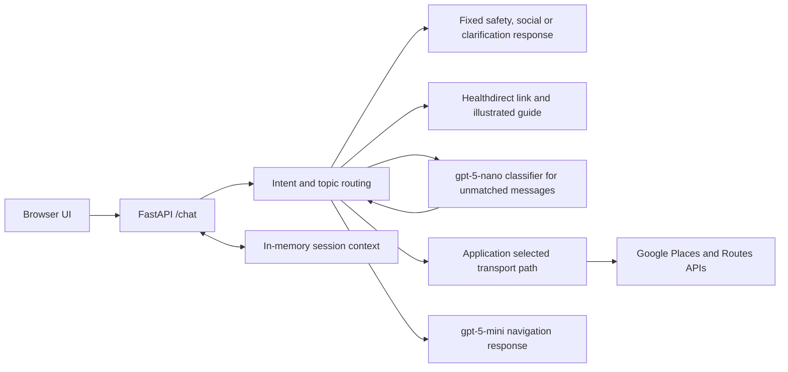
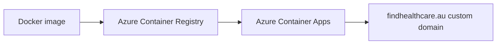

# Find Healthcare

Find Healthcare (Medical Navigator) is a public prototype that helps people understand and access Australian healthcare services. It focuses on practical questions about Medicare, referrals, finding services and getting to a facility, with short answers designed for people who may be unfamiliar with the system or face language or digital access barriers.

| | |
| --- | --- |
| **Live** | [findhealthcare.au](https://findhealthcare.au) |
| **Purpose** | Accessible navigation of Australian healthcare services |
| **Built with** | FastAPI · OpenAI · Google Maps Platform · Docker · Azure |
| **Status** | Public prototype |


This is a healthcare navigation tool. It does not provide diagnosis, treatment or personalised medical advice.

## The problem

Australian healthcare information and services are available, but knowing which service to look for, how to access it and where to start can still be difficult. Find Healthcare brings common access questions into a simple conversational interface and links users to an established service finder when they need to search locally.

## What it does

Users can ask questions such as “How do I get a Medicare card?”, “Do I need a referral to see a specialist?” or “How do I get to the Royal Children’s Hospital by public transport?”. The application can:

- Explain non-clinical healthcare access and administrative pathways in plain language.
- Guide service searches to the [Healthdirect Service Finder](https://www.healthdirect.gov.au/australian-health-services), with illustrated search and filter steps. This is a link and guide, not an integration with a Healthdirect API or a search of Healthdirect listings.
- Resolve a named facility with Google Places, show nearby tram, bus and train access with estimated walking distance, and request a Google Routes transit journey when an origin is supplied. Ambiguous facility names prompt a choice.
- Respond to English and Chinese input in the model-led navigation path. Rule-based responses and the interface are primarily in English, so language coverage is partial.

The browser uses a session ID for follow-up questions. The server keeps the current topic, selected facility and up to six recent turns per session in process memory.

## Safety and scope

The application checks for a pending facility choice, then routes other messages by intent before generating a navigation answer. The router checks explicit patterns in English and Chinese first; messages without a match go to a small model for classification. The main answer model only handles navigation requests that are not satisfied by a dedicated application path.

| Intent | Current handling |
| --- | --- |
| Emergency | A fixed response directs the user to Triple Zero (000) or an emergency department. |
| Clinical advice | A fixed refusal covers diagnosis, symptoms, treatment, medication and test interpretation, with a GP access suggestion. |
| Social or unrelated | A short fixed acknowledgement or scope message. |
| Unclear | Ask what help is needed; a follow-up can use the active navigation topic. |
| Navigation | Use the Healthdirect guide, transport tools or a constrained model response, depending on the request. |

The model instruction also prohibits clinical triage, symptom-based service recommendations and invented transport directions. These controls reduce inappropriate responses but are pattern- and model-dependent; they are not a clinical safety guarantee. Users should verify important service and travel details with the relevant provider.

## Architecture



The application, rather than the model, selects the service finder and transport paths. For transport requests, `gpt-5-nano` extracts an origin and destination; Python code then calls Google Places and Routes and formats the result. General navigation answers use `gpt-5-mini` through the OpenAI Responses API with a navigation-specific instruction and recent topic context. There is no autonomous agent loop or model-directed function calling in the current implementation.

This split keeps common greetings, safety responses, service finder guidance and some routing off the main answer model. Unmatched messages and transport extraction can still incur model calls; Google requests can incur separate API costs.

## Technology stack

The backend is Python 3.11+ with FastAPI, Pydantic, the OpenAI SDK and `httpx`. The frontend is a single HTML/CSS/JavaScript page served by FastAPI. Dependencies are locked with `uv`; tests use `pytest` and FastAPI's `TestClient`.

## Deployment



The repository's `Dockerfile` builds a Python 3.12 image, installs locked production dependencies with `uv`, copies the app and starts Uvicorn on port 8000. `GET /` serves the page, `POST /chat` handles requests and `GET /health` provides a health endpoint. The [deployment summary](docs/deployment.md) records the production architecture without infrastructure identifiers or secrets.

## Running locally

Install [uv](https://docs.astral.sh/uv/) and use Python 3.11 or newer. Configure an `.env` file in the project root (ignored by Git):

```dotenv
OPENAI_API_KEY=your_openai_api_key
GOOGLE_MAPS_API_KEY=your_google_maps_api_key
```

The Google key needs access to the Places and Routes APIs for transport features. Then run:

```bash
uv sync
uv run uvicorn app.main:app --reload
```

Open `http://localhost:8000`. For a container run, pass the same environment variables through an environment file:

```bash
docker build -t find-healthcare .
docker run --env-file .env -p 8000:8000 find-healthcare
```

## Testing

```bash
uv run pytest
uv run pytest -m live  # calls external APIs; requires credentials and may incur cost
```

The default suite excludes `live` tests. Local tests cover intent and topic routing, service finder detection, session memory and fixed safety responses. Marked live tests exercise classifier decisions and model-generated navigation answers. There are currently no automated tests for the Google transport tools or deployment configuration.

## Project structure

```text
app/
  main.py            # FastAPI endpoints and response orchestration
  router.py          # Intent, topic and transport request detection
  memory.py          # Per-session, in-process conversation state
  tools/transport.py # Google Places and Routes requests
  static/            # Browser UI and Healthdirect guide images
tests/               # Routing, memory, safety and marked live tests
Dockerfile           # Production container image
pyproject.toml       # Dependencies and test configuration
uv.lock              # Locked dependencies
```

## Design decisions

- **Route before generating:** Fixed responses handle recognised safety, social and unrelated intents; the main model is reserved for general navigation answers.
- **Keep clinical boundaries explicit:** Clinical and emergency requests have dedicated responses, while the navigation prompt forbids diagnosis and symptom-based triage.
- **Use existing service infrastructure:** The service finder path teaches users how to search Healthdirect rather than presenting unverified listings as first-party results.
- **Ground travel details externally:** Facility and transport information comes from Google APIs. The app reports routes and nearby stops, but does not provide live departure times or service alerts.
- **Keep context small:** Topic-filtered memory supports follow-ups, but it is held only in the running process, has no expiry or persistence layer, and is not shared across instances.

## Current limitations & roadmap

This is a prototype with partial Chinese coverage, in-process session memory and no live departure times. Intent rules cannot recognise every phrasing, and external API errors do not always produce a friendly response. The application has no rate limiting yet. Next steps include broader bilingual handling, transport tool tests, persistent session management and stronger operational controls.

## Disclaimer

Find Healthcare is a prototype for healthcare navigation. It is not a substitute for professional medical advice, diagnosis, treatment or emergency services. If you believe you are facing an emergency in Australia, call Triple Zero (000).
