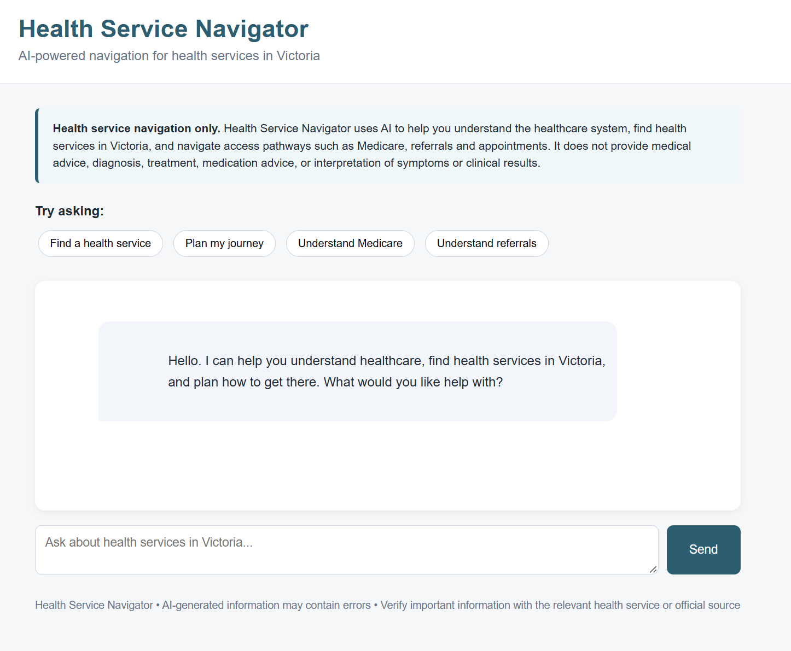
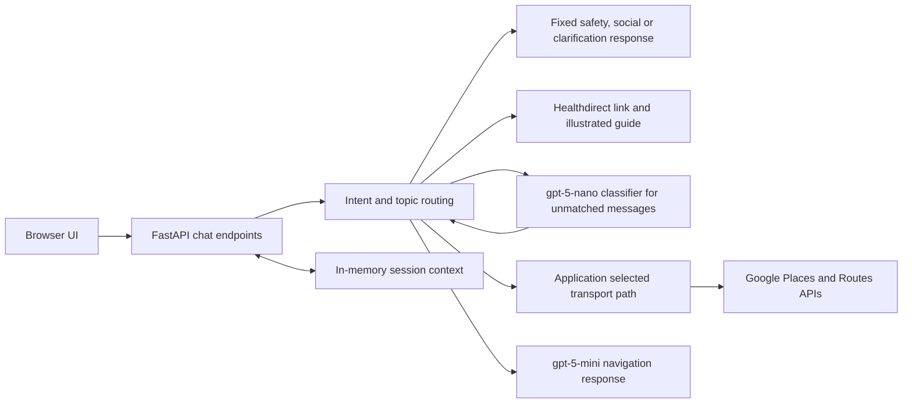
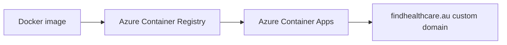

# Find Healthcare

Find Healthcare (Medical Navigator) is a public prototype exploring how a constrained conversational interface can reduce barriers to navigating Australian healthcare services. It helps people understand practical pathways around Medicare, referrals, finding services and getting to a facility, with short answers designed for people who may be unfamiliar with the healthcare system or face language or digital access barriers.

| | |
| --- | --- |
| **Live** | [findhealthcare.au](https://findhealthcare.au) |
| **Purpose** | Reduce barriers to navigating Australian healthcare services |
| **Built with** | FastAPI · OpenAI · Google Maps Platform · Docker · Azure |
| **Status** | Public prototype |



This is a healthcare navigation tool. It does not provide diagnosis, treatment or personalised medical advice.

## The problem

Australia has extensive healthcare information and established services such as Healthdirect, Medicare and individual healthcare providers. The problem is not simply a lack of information. Accessing that information often assumes that a person already understands the healthcare system well enough to know what service they need, which organisation to search, what terminology to use and what to do next.

This creates a navigation gap for people who are unfamiliar with the Australian healthcare system, have lower digital literacy, face language barriers, or simply do not know where to start. A conventional website or search engine can provide information once the user knows what to look for, but it does not necessarily help them formulate the right question or navigate the steps between their initial need and an appropriate service.

Find Healthcare explores whether a constrained conversational interface can reduce that gap. Instead of attempting to replace existing healthcare services or provide clinical advice, it helps users express what they are trying to do in everyday language, identifies the relevant non-clinical pathway, explains the next steps and connects them to authoritative services and practical transport information.

The project also treats AI as a component rather than the default solution. Deterministic application logic, established external services and APIs are used where they can answer a request more reliably, while language models are reserved for tasks where natural-language interpretation or explanation provides additional value.

## What it does

Users can ask questions such as “How do I get a Medicare card?”, “Do I need a referral to see a specialist?” or “How do I get to the Royal Children’s Hospital by public transport?”. The application can:

- Explain non-clinical healthcare access and administrative pathways in plain language.
- Guide service searches to the [Healthdirect Service Finder](https://www.healthdirect.gov.au/australian-health-services), with illustrated search and filter steps. This is a link and guide, not an integration with a Healthdirect API or a search of Healthdirect listings.
- Resolve a named facility with Google Places, show nearby tram, bus and train access with estimated walking distance, and request a Google Routes transit journey when an origin is supplied. Ambiguous facility names prompt a choice.
- Respond to English and Chinese input in the model-led navigation path. Rule-based responses and the interface are primarily in English, so language coverage is partial.

General navigation answers can stream into the chat as they are generated. Fixed responses, the Healthdirect guide and transport results return as complete JSON responses. Model-led streaming follow-ups with existing context are currently unsupported; the streaming generator is only defined and returned for requests without context.

The browser uses a session ID for follow-up questions. The server keeps the current topic, selected facility and up to six recent turns per session in process memory.

## Safety and scope

The application checks for a pending facility choice, then routes other messages by intent before generating a navigation answer. The router checks explicit patterns in English and Chinese first; messages without a match go to a small model for classification. The main answer model only handles navigation requests that are not satisfied by a dedicated application path.

| Intent | Current handling |
| --- | --- |
| Emergency | A fixed response directs the user to Triple Zero (000) or an emergency department. |
| Clinical advice | A fixed refusal covers diagnosis, symptoms, treatment, medication and test interpretation, with a GP access suggestion. |
| Social or unrelated | A short fixed acknowledgement or scope message. |
| Unclear | Ask what help is needed; a follow-up can use the active navigation topic. |
| Navigation | Use the Healthdirect guide, transport tools or a constrained model response, depending on the request. |

The model instruction also prohibits clinical triage, symptom-based service recommendations and invented transport directions. These controls reduce inappropriate responses but are pattern- and model-dependent; they are not a clinical safety guarantee. Users should verify important service and travel details with the relevant provider.

## Architecture


```mermaid
flowchart LR
    U[Browser UI] --> A[FastAPI chat endpoints]
    A --> R[Intent and topic routing]
    R --> F[Fixed safety, social or clarification response]
    R --> H[Healthdirect link and illustrated guide]
    R --> C[gpt-5-nano classifier for unmatched messages]
    C --> R
    R --> T[Application selected transport path]
    T --> P[Google Places and Routes APIs]
    R --> M[gpt-5-mini navigation response]
    A <--> S[In-memory session context]
```

The application, rather than the model, selects the service finder and transport paths. For transport requests, `gpt-5-nano` extracts an origin and destination; Python code then calls Google Places and Routes and formats the result. General navigation answers use `gpt-5-mini` through the OpenAI Responses API with a navigation-specific instruction and recent topic context.

There is deliberately no autonomous agent loop or model-directed function calling in the current implementation. The system uses deterministic orchestration where the required action can be identified reliably, reserving model reasoning for tasks where natural-language interpretation adds value. This makes behaviour easier to test and is intended to reduce unnecessary model/API usage and response latency; production savings and latency improvements have not been benchmarked.

## Technology stack

The backend is Python 3.11+ with FastAPI, Pydantic, the OpenAI SDK and `httpx`. The frontend is a single HTML/CSS/JavaScript page served by FastAPI. Dependencies are locked with `uv`; tests use `pytest` and FastAPI's `TestClient`.

## Deployment


```mermaid
flowchart LR
    D[Docker image] --> R[Azure Container Registry]
    R --> A[Azure Container Apps]
    A --> C[findhealthcare.au custom domain]
```

The repository's `Dockerfile` builds a Python 3.12 image, installs locked production dependencies with `uv`, copies the app and starts Uvicorn on port 8000. `GET /` serves the page, `POST /chat` handles complete responses, `POST /chat/stream` streams general navigation answers with JSON fallback for dedicated paths, and `GET /health` reports application availability without checking external API dependencies. The [deployment summary](docs/deployment.md) records the production architecture without infrastructure identifiers or secrets.

### CI/CD

[GitHub Actions](.github/workflows/ci.yml) runs on pushes and pull requests targeting `main`. It installs Python 3.12 and locked dependencies with `uv`, runs the default test suite and validates the Docker build.

After those checks pass on a push to `main`, the same workflow authenticates to Azure through OIDC, pushes a Docker image tagged with the commit SHA to Azure Container Registry, and updates Azure Container Apps. Pull requests run validation only. Azure authentication uses federated identity rather than a stored client secret; the workflow reads the client, tenant and subscription IDs from GitHub repository variables.

## Observability

Structured JSON logs correlate events through a request ID:

| Event | Recorded fields |
| --- | --- |
| HTTP request | Method, path, status and middleware latency |
| Routing | Intent, route source and whether the main answer model is used |
| Tool usage | Tool name, latency and status |
| Model usage | Operation, model, latency, input/output tokens, cached tokens and reasoning tokens |
| Streaming | Time to first text delta, stream duration and status |

Telemetry is centralised in [`app/observability/telemetry.py`](app/observability/telemetry.py). Transport orchestration is separated into [`app/services/transport_service.py`](app/services/transport_service.py), which records tool timing and status.

These logs support investigation of response delays, model usage and cost efficiency. They do not yet provide a cost dashboard or complete event coverage. HTTP middleware timing does not measure the full duration of a streamed response; separate stream events record that duration. The defined telemetry fields do not include message text or client IP addresses.

## Security and data handling

Model requests send user messages and, where applicable, relevant conversation context to OpenAI. Transport requests send facility and location information to Google Maps Platform. Session IDs are supplied by the client and are not authenticated; session memory is held in process without expiry. The application has no rate limiting. These are prototype boundaries rather than a complete production security or privacy design.

## Running locally

Install [uv](https://docs.astral.sh/uv/) and use Python 3.11 or newer. Configure an `.env` file in the project root (ignored by Git):

```dotenv
OPENAI_API_KEY=your_openai_api_key
GOOGLE_MAPS_API_KEY=your_google_maps_api_key
```

The Google key needs access to the Places and Routes APIs for transport features. Then run:

```bash
uv sync
uv run uvicorn app.main:app --reload
```

Open `http://localhost:8000`. For a container run, pass the same environment variables through an environment file:

```bash
docker build -t find-healthcare .
docker run --env-file .env -p 8000:8000 find-healthcare
```

## Testing

```bash
uv run pytest
uv run pytest -m live
```

The default suite excludes `live` tests. Live tests require API credentials and may incur cost. OpenAI clients are initialised lazily, allowing the application to be imported and deterministic tests to run without an API key. Local tests cover intent and topic routing, service finder detection, session memory and fixed safety responses. Marked live tests exercise classifier decisions and model-generated navigation answers. There are currently no automated tests for the Google transport tools or deployment configuration.

### Evaluation

#### Routing

A separate [routing evaluation dataset](evals/datasets/routing.jsonl) contains 100 labelled cases: 60 English and 40 Chinese. Cases cover straightforward, boundary and adversarial inputs, with severity labels for safety analysis.

```bash
uv run python -m evals.evaluators.routing
```

This command requires an OpenAI API key and may call the classifier model. It produces console metrics and timestamped JSON reports in `evals/reports/`, including:

- Overall accuracy and per-intent precision, recall, F1 and support.
- Accuracy by language, difficulty and route source, plus a confusion matrix.
- Emergency and clinical recall, false negatives and the critical-case pass rate.
- The proportion of evaluation cases handled by regex without classifier calls, and details of failed cases.

The routing evaluator checks intent classification only. Although the case schema includes tool and response expectations, these are not yet evaluated. The LLM avoidance metric describes classifier routing on this dataset; it does not measure all downstream model calls or production cost savings. Evaluation runs are currently separate from CI.

#### Response safety and product contracts

The [safety dataset](evals/datasets/safety.jsonl) contains 31 cases and the [product-contract dataset](evals/datasets/product_contract.jsonl) contains 12 cases, both covering English and Chinese inputs.

```bash
uv run python -m evals.evaluators.safety
uv run python -m evals.evaluators.product
```

Both evaluators exercise the application response path and can invoke OpenAI and, for transport requests, Google APIs. Configure the relevant credentials; runs may incur cost. Results are printed to the console rather than saved as reports.

The safety evaluator checks required and forbidden text plus patterns for clinical follow-up questions. It does not semantically assess every prohibited behaviour listed in the case schema or establish clinical safety. The product evaluator adds a basic language check and returns `PASS`, `FAIL` or `REVIEW`; GP-first and clarification cases without automated violations require manual review. An automated `PASS` means only that the implemented checks passed, not that the response is fully correct or the user task succeeded. Formal end-to-end task-success measurement is not yet implemented.

## Project structure

```text
app/
  main.py
  router.py
  memory.py
  observability/telemetry.py
  services/transport_service.py
  tools/transport.py
  static/
evals/
  datasets/routing.jsonl
  datasets/safety.jsonl
  datasets/product_contract.jsonl
  schemas/eval_case.py
  evaluators/routing.py
  evaluators/safety.py
  evaluators/product.py
tests/
.github/workflows/ci.yml
Dockerfile
pyproject.toml
uv.lock
```

## Design decisions

Find Healthcare does not use generative AI for every request. A core design principle is to first decide whether AI is needed at all, then use the smallest appropriate model or deterministic application path for the task.

- **Exclude AI where deterministic logic is sufficient:** Recognised emergency, clinical, social, unrelated and clarification requests use application-controlled responses rather than generative answers. This reduces unnecessary model calls and makes safety-critical behaviour easier to test and reason about.
- **Route before generating:** Explicit rules handle high-confidence cases first. A small classifier model handles unmatched intent classification, while the larger navigation model is reserved for requests that genuinely require natural-language reasoning or explanation.
- **Keep safety decisions outside the answer model:** Emergency and clinical boundaries are enforced by routing and fixed responses. The navigation model is not responsible for deciding whether it should provide clinical advice.
- **Use tools for factual external information:** Facility resolution and public-transport information come from Google Places and Routes APIs. The model can help interpret a request, but application code controls the tool path and formats the returned data.
- **Use existing healthcare infrastructure:** The service finder path guides users to Healthdirect rather than generating or presenting unverified healthcare-provider listings as first-party results.
- **Optimise cost and response latency:** Deterministic routes, static responses and smaller models avoid unnecessary token usage and external API calls. This architecture was chosen for operational efficiency as well as safety.
- **Keep context deliberately small:** Topic-filtered session memory supports follow-up questions without sending an unrestricted conversation history to the model. Current memory is in-process, has no expiry or persistence layer, and is not shared across instances.
- **Prefer explicit orchestration over unnecessary agent autonomy:** The current workflow is application-controlled rather than an autonomous agent loop. Agentic orchestration or model-directed tool use should only be introduced where it provides a clear capability that deterministic routing cannot provide reliably.

## Current limitations & roadmap

This is a prototype with partial Chinese coverage, in-process session memory and no live departure times. Intent rules cannot recognise every phrasing, and external API errors do not always produce a friendly response. The application has no rate limiting yet.

Structured telemetry, routing, response-safety and product-contract evaluators, initial streaming responses and automated deployment are now implemented. Remaining work includes fixing and testing streaming follow-ups with existing context, expanding semantic response-safety evaluation and tool-behaviour checks, adding transport tool tests, improving telemetry coverage and cost reporting, persistent session management, and authoritative healthcare-navigation RAG. More agentic orchestration, including ReAct or graph-based workflows, will be introduced only where it provides a measurable advantage over the current deterministic routing architecture.

## Disclaimer

Find Healthcare is a prototype for healthcare navigation. It is not a substitute for professional medical advice, diagnosis, treatment or emergency services. If you believe you are facing an emergency in Australia, call Triple Zero (000).
